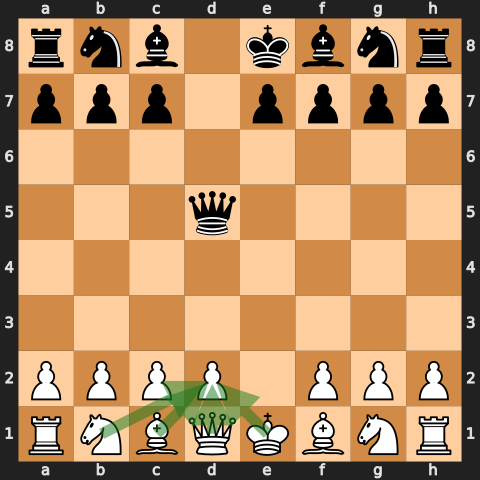
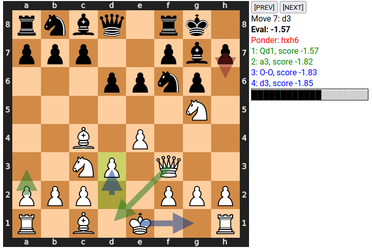

# PGN processing

Random collection of scripts and snippets using `python-chess` to filter,
convert, visualize etc. chess PGN files.

## Scripts

## .
[**fen2-svg.py**](fen2-svg.py):
Generate SVG image of a given board.

\
[**pgn2fen.py**](pgn2fen.py):
Print FEN of each move (PGN game).

\
[**pgn2hex.py**](pgn2hex.py):
Experimental PGN move compression, the UCI notation move encoded as 2 bytes,
4 nibbles, e2e4 -> 0x5254 (a -> 1, b -> 2, ...). (Note: does not handle promotions.)

\
[**pgn2sqlite.py**](pgn2sqlite.py):
Convert a large PGN to sqlite database (selected headers), batched commit for
speed up.

\
[**pgn2uci.py**](pgn2uci.py):
Print game notation in UCI format (like *1. e2e4 (e4)*).

\
[**pgn-defenders.py**](pgn-defenders.py):
Find defenders of your piece in a given position (Scandi btw).
  

\
[**pgn-extractfirst.py**](pgn-extractfirst.py):
Extract first N games from a given PGN file

\
[**pgn-filterelo.py**](pgn-filterelo.py):
Filter games in a given PGN file by players' Elo.

\
[**pgn-piece-path.py**](pgn-piece-path.py):
Generate file *arrows.html* with SVG images of piece movement for the whole
game.  Sample game is in *arrows.html*, self-contained HTML file with embedded
SVG graphics and game moves.

\
[**pgn-plycount.py**](pgn-plycount.py):
Count number of plies (half-moves).

\
[**pgn-print-eval.py**](pgn-print-eval.py):
Print evaluation of each move in a PGN game (default engine settings).

\
[**pgn-readheaders.py**](pgn-readheaders.py):
Print headers of all games in a given PGN file.

\
[**pgn-to-html.py**](pgn-to-html.py):
Generate *game.html* with annotated board (last move, top moves, engine eval),
navigation buttons (PGN game1.pgn)
  

## gui
[**show-svg.py**](gui/show-svg.py):
PyQT5 GUI application to show a given board (SVG)

